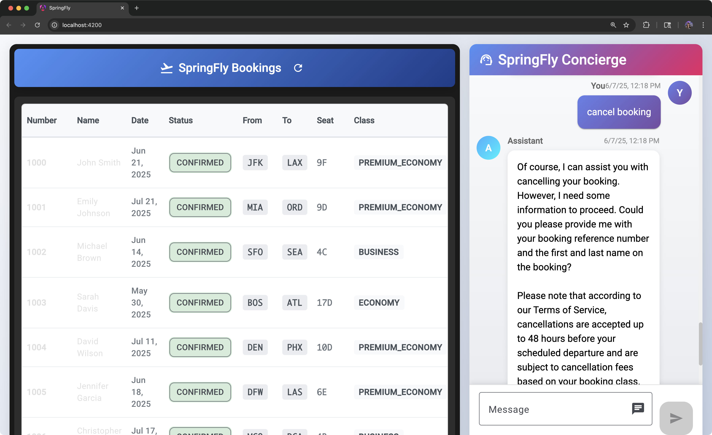

# SpringFly Airlines - AI-Powered Flight Booking System

**SpringFly Airlines** - Revolutionizing air travel with AI-powered customer service! ✈️🤖

A modern, full-stack flight booking application powered by Spring AI, Angular and Gemini, featuring an intelligent customer support chatbot and comprehensive booking management system.


## 🚀 Features

### 🤖 AI-Powered Customer Support
- **Intelligent Chatbot**: Gemini powered customer service agent
- **RAG Implementation**: Retrieval-Augmented Generation using PGVector for company policies
- **Function Calling**: Direct integration with booking tools for real-time operations
- **Memory Management**: Persistent conversation history across chat sessions

### ✈️ Booking Management
- **Real-time Booking Display**: Live view of all flight bookings
- **Responsive Design**: Mobile-first approach with Material Design
- **Booking Operations**: View, modify, and cancel bookings through AI assistant

### 🏗️ Technical Architecture
- **Backend**: Spring Boot 3.5.0 with Spring AI framework
- **Frontend**: Angular v20 with Angular Material
- **Database**: PostgreSQL with PGVector extension for embeddings
- **AI Integration**: Gemini for chat completions
- **Vector Store**: PGVector for document similarity search
- **Container**: Docker Compose for local development

<p align="center">
  
</p>

## 🛠️ Technology Stack

### Backend
- **Spring Boot 3.5.0** - Main application framework
- **Spring AI 1.0.0** - AI integration and tooling
- **Gemini** - Language model for chat responses
- **PostgreSQL** - Primary database
- **PGVector** - Vector database for embeddings
- **Java 24** - Programming language

### Frontend
- **Angular 20** - Frontend framework
- **Angular Material** - UI component library
- **TypeScript 5.8** - Programming language
- **RxJS** - Reactive programming
- **SCSS** - Styling

### DevOps
- **Docker Compose** - Local development environment
- **Maven** - Build tool and dependency management

## 📋 Prerequisites

- **Java 24** or higher
- **Node.js 18+** and npm
- **Docker** and Docker Compose
- **Gemini Project key**

## 🚀 Quick Start

### 1. Clone the Repository
```bash
git clone https://github.com/yourusername/spring-ai-flight-booking.git
cd spring-ai-flight-booking
```

### 2. Environment Setup
Create a `.env` file in the root directory:
```env
DB_PASSWORD=secret
```

### 3. Start the Database
```bash
docker-compose up -d
```

### 4. Run the Backend
```bash
./mvnw spring-boot:run
```

### 5. Run the Frontend
```bash
cd frontend
npm install
npm start
```

### 6. Access the Application
- **Frontend**: http://localhost:4200
- **Backend API**: http://localhost:8080

## 🏗️ Project Structure

```
spring-ai-flight-booking/
├── src/main/java/com/loiane/springfly/
│   ├── controller/           # REST controllers
│   ├── service/             # Business logic and AI services
│   ├── model/               # Data models
│   └── config/              # Configuration classes
├── src/main/resources/
│   ├── application.properties
│   └── rag/                 # RAG documents
├── frontend/
│   ├── src/app/
│   │   ├── components/      # Angular components
│   │   ├── services/        # Angular services
│   │   └── types/           # TypeScript interfaces
│   └── package.json
├── compose.yaml             # Docker Compose configuration
└── pom.xml                  # Maven configuration
```

## 🤖 AI Features Deep Dive

### Chat Service Architecture
The AI-powered customer support system includes:

- **System Prompts**: Carefully crafted instructions for SpringFly Airlines customer service
- **Memory Management**: Conversation history preservation using ChatMemory
- **Vector Store Integration**: RAG implementation for accessing company policies
- **Function Tools**: Direct booking management capabilities

### Available AI Tools
- `getBookingDetails` - Retrieve booking information
- `changeBooking` - Modify existing reservations
- `cancelBooking` - Process cancellation requests

### RAG Implementation
The system uses company terms of service and policies stored as embeddings in PGVector, allowing the AI to provide accurate, context-aware responses about:
- Booking policies
- Change fees by class
- Cancellation procedures
- Company terms of service

## 📡 API Endpoints

### Customer Support
- `POST /api/customer-support` - Send chat message to AI assistant

### Booking Management
- `GET /api/booking` - Retrieve all bookings
- Additional endpoints available through AI function calling

## 🧪 Testing

### Run Backend Tests
```bash
./mvnw test
```

### Run Frontend Tests
```bash
cd frontend
npm test
```

## 🚢 Deployment

### Building for Production

#### Backend
```bash
./mvnw clean package
java -jar target/springfly-0.0.1-SNAPSHOT.jar
```

#### Frontend
```bash
cd frontend
npm run build
```

### Docker Deployment
The application includes Docker Compose configuration for easy deployment with PostgreSQL and PGVector.

## 🤝 Contributing

1. Fork the repository
2. Create a feature branch (`git checkout -b feature/amazing-feature`)
3. Commit your changes (`git commit -m 'Add some amazing feature'`)
4. Push to the branch (`git push origin feature/amazing-feature`)
5. Open a Pull Request

## 📝 License

This project is licensed under the MIT License - see the [LICENSE](LICENSE) file for details.
